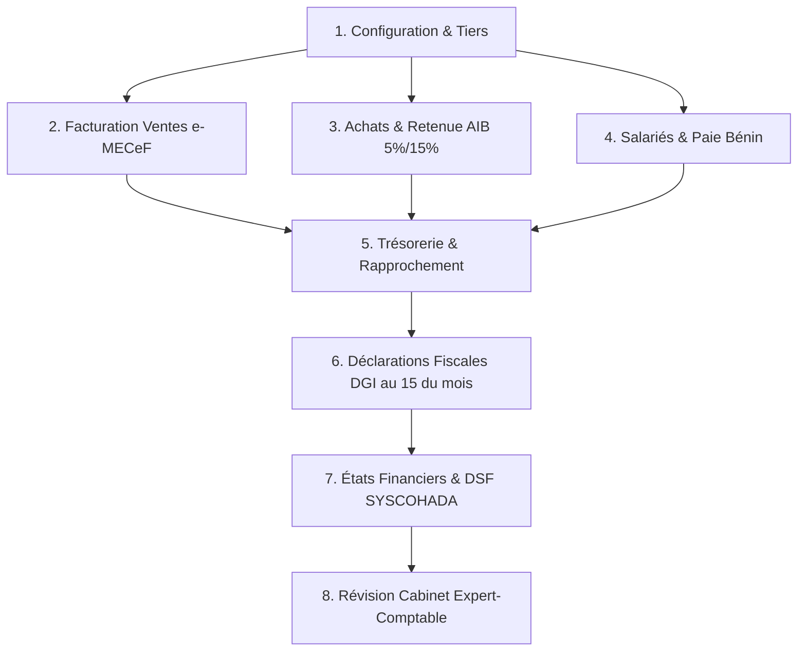

# 🇧🇯 GUIDE COMPLET DE GESTION D'UNE ENTREPRISE AU BÉNIN
## Manuel Pratique & Cahier de Tests de A à Z sur la Plateforme Comptia

---

| **Fiche Synthèse** | **Détails de l'Entreprise Modèle pour les Tests** |
| :--- | :--- |
| **Raison Sociale** | **BÉNIN DIGITAL SERVICES SARL** |
| **Numéro IFU** | `3202687290154` (13 chiffres officiels) |
| **Numéro RCCM** | `RB/COT/24 B 12345` (Greffe du Tribunal de Commerce de Cotonou) |
| **Régime Fiscal** | **Régime Réel Normal** (Assujetti à la TVA 18% + Retenue AIB + IPTS + CNSS + VPS) |
| **Secteur d'Activité** | **Services & Technologies** |
| **Banque & Trésorerie** | Compte Bancaire Principal (BOA Bénin) + Compte Marchand MTN Mobile Money |

---



---

## 🚀 PHASE 1 : Initialisation & Configuration de l'Entreprise

### Cas 1.1 : Vérification des paramètres de l'entreprise
1. Allez dans **Paramètres** (ou vérifiez votre profil d'entreprise).
2. Vérifiez que la devise est bien le **FCFA (XOF)** et que le régime fiscal est **Régime Réel**.
3. Solde initial de trésorerie : `5 000 000 FCFA` (apport en capital déposé à la banque).

---

### Cas 1.2 : Création du Répertoire des Tiers (Clients & Prestataires)
Allez dans **Comptabilité $\rightarrow$ Comptes de tiers** (`/comptabilite/tiers`) et créez les tiers suivants :

#### 🔹 Tiers 1 (Client Entreprise)
- **Type** : `Client`
- **Nom** : `Société Bénin Digital SARL`
- **IFU** : `3202687290154`
- **Email** : `contact@benindigital.bj` | **Téléphone** : `+229 97 00 00 01`

#### 🔹 Tiers 2 (Prestataire avec IFU - Taux AIB 5%)
- **Type** : `Fournisseur`
- **Nom** : `Cabinet Juridique & Fiscal AFRIKA SARL`
- **IFU** : `3201987456123`
- **Email** : `contact@afrikajuriste.bj` | **Conditions** : Paiement à 30 jours

#### 🔹 Tiers 3 (Prestataire Informel / Sans IFU - Taux AIB 15%)
- **Type** : `Fournisseur`
- **Nom** : `M. SOGLO Patrick (Technicien Réseau Indépendant)`
- **IFU** : *(Laisser vide)*
- **Téléphone** : `+229 95 11 22 33`

---

## 🧾 PHASE 2 : Facturation Commerciale, e-MECeF DGI & Ventes

---

### 🧪 Test 2.1 : Émission d'un Devis Commercial (Proforma)
> **Scénario** : Vous proposez une offre commerciale pour la refonte du site web et l'audit cybersécurité d'un client.

1. Allez sur **Facturation** $\rightarrow$ Cliquez sur **« + Nouvelle facture »**.
2. **Type** : Choisissez `Devis`.
3. **Client** : `Société Bénin Digital SARL`.
4. **Lignes du devis** :
   - **Ligne 1** : `Refonte plateforme web & mobile` | Qté : `1` | Prix HT : `1 500 000` | TVA : `18%`
   - **Ligne 2** : `Audit et sécurisation serveur` | Qté : `1` | Prix HT : `500 000` | TVA : `18%`
5. **Résultats calculés automatiquement** :
   - Sous-total HT : **2 000 000 FCFA**
   - TVA (18%) : **360 000 FCFA**
   - Total TTC : **2 360 000 FCFA**
6. Cliquez sur **« Enregistrer devis »**.

✅ **Vérification** :
- Le devis apparaît dans l'onglet **Devis** avec la référence `DEV-2026-0000X`.
- Aucun impact sur la comptabilité générale (un devis n'est pas une dette tant qu'il n'est pas signé).

---

### 🧪 Test 2.2 : Émission d'une Facture Définitive avec Normalisation e-MECeF (DGI)
> **Scénario** : Le client valide la commande. Vous émettez la facture officielle normalisée SyGMEF / e-MECeF.

1. Cliquez sur **« + Nouvelle facture »**.
2. **Type** : `Facture`.
3. **Client** : `Société Bénin Digital SARL`.
4. **Date d'émission** : Date du jour | **Échéance** : +30 jours.
5. **Mode de règlement prévu** : `MTN Mobile Money (MoMo)`.
6. **Ligne de facture** :
   - **Description** : `Développement plateforme web & maintenance annuelle`
   - **Quantité** : `1` | **Prix HT** : `1 000 000` | **TVA** : `18%`
7. **Montants** :
   - Total HT : **1 000 000 FCFA**
   - TVA (18%) : **180 000 FCFA**
   - Total TTC : **1 180 000 FCFA**
8. Cliquez sur **« Enregistrer facture »**.

✅ **Ce que la plateforme génère automatiquement** :
1. **Certification e-MECeF DGI** :
   - **NIM** : Ex. `TS01000001`
   - **Code MECeF/DGI** : Ex. `MECeF-20260827-TS01000001-KMFSHZ`
   - **QR Code officiel DGI** : Lien de vérification en direct sur `https://mecef.impots.bj/verify`.
2. **Écritures Comptables Automatiques (SYSCOHADA)** dans le Journal des Ventes :
   - 🔵 **Débit Compte `411 - Clients`** : `1 180 000 FCFA` (Créance TTC)
   - 🔴 **Crédit Compte `706 - Prestations de services`** : `1 000 000 FCFA` (Produit HT)
   - 🔴 **Crédit Compte `4431 - TVA facturée sur ventes`** : `180 000 FCFA` (Dette fiscale envers l'État)

---

### 🧪 Test 2.3 : Encaissement du Client par MTN Mobile Money
> **Scénario** : Le client règle la facture de 1 180 000 FCFA sur votre compte marchand MTN MoMo.

1. Allez dans **Comptabilité $\rightarrow$ Nouvelle écriture**.
2. **Journal** : `Caisse / Trésorerie` (ou Banque).
3. **Date** : Date du jour | **Référence** : `ENC-MOMO-FAC001`.
4. **Description** : `Règlement client FAC-2026-00001 par MTN MoMo`.
5. **Lignes d'écriture** :
   - Ligne 1 : Compte **`585 - Mobile Money (MTN MoMo)`** $\rightarrow$ **Débit : `1 180 000 FCFA`**
   - Ligne 2 : Compte **`411 - Clients`** (Tiers : *Société Bénin Digital*) $\rightarrow$ **Crédit : `1 180 000 FCFA`**
6. Cliquez sur **« Enregistrer écriture »**.

✅ **Vérification** :
- Le solde du client `411` redevient **0 FCFA** (Créance soldée).
- Votre solde de trésorerie Mobile Money augmente de **1 180 000 FCFA**.

---

### 🧪 Test 2.4 : Facture d'Avoir (Remise Commerciale Accordée)
> **Scénario** : Vous accordez une remise commerciale exceptionnelle de 100 000 FCFA HT au client.

1. Cliquez sur **« + Nouvelle facture »** $\rightarrow$ Sélectionnez `Avoir`.
2. **Client** : `Société Bénin Digital SARL`.
3. **Description** : `Remise commerciale sur contrat web` | Prix HT : `100 000` | TVA : `18%`.
4. **Total Avoir TTC** : **118 000 FCFA**.
5. Cliquez sur **« Enregistrer avoir »**.

✅ **Écritures d'Avoir passées automatiquement** :
- 🔵 **Débit Compte `706`** : `100 000 FCFA` (Diminution du chiffre d'affaires)
- 🔵 **Débit Compte `4431`** : `18 000 FCFA` (Régularisation de TVA)
- 🔴 **Crédit Compte `411`** : `118 000 FCFA` (Diminution de la dette client)

---

## 📦 PHASE 3 : Achats, Prestataires & Retenue à la Source (AIB Bénin)

---

### 🧪 Test 3.1 : Prestation avec Prestataire Immatriculé (Retenue AIB 5%)
> **Scénario** : Le `Cabinet Juridique & Fiscal AFRIKA SARL` (qui a un IFU) vous facture des honoraires de conseil juridique de **`300 000 FCFA HT`** (TVA 18% = `54 000 FCFA` $\rightarrow$ Total TTC : `354 000 FCFA`).
>
> 📌 **Règle Fiscale Bénin** : Prestataire avec IFU $\rightarrow$ Vous devez retenir **5% d'AIB** sur le montant HT ($300\,000 \times 5\% = 15\,000 \text{ FCFA}$).

1. **Enregistrement de la facture d'honoraires** dans **Comptabilité $\rightarrow$ Nouvelle écriture** (Journal *Achats*) :
   - 🔵 **Débit `6324 - Honoraires juridiques et fiscaux`** : `300 000 FCFA`
   - 🔵 **Débit `4452 - TVA récupérable sur services`** : `54 000 FCFA`
   - 🔴 **Crédit `401 - Cabinet Juridique AFRIKA`** : `354 000 FCFA`

2. **Règlement du prestataire avec application de la retenue AIB 5%** (Journal *Banque*) :
   - 🔵 **Débit `401 - Cabinet Juridique AFRIKA`** : `354 000 FCFA` (Dette fournisseur soldée)
   - 🔴 **Crédit `521 - Banque BOA Bénin`** : `339 000 FCFA` *(Paiement net : 354 000 - 15 000)*
   - 🔴 **Crédit `4472 - AIB / Retenue à la source sur prestations (5%)`** : `15 000 FCFA` *(Dette envers la DGI)*

---

### 🧪 Test 3.2 : Prestation avec Prestataire Non Immatriculé (Retenue AIB 15%)
> **Scénario** : `M. SOGLO Patrick` (technicien indépendant sans IFU) effectue une réparation du réseau informatique pour **`100 000 FCFA`**.
>
> 📌 **Règle Fiscale Bénin** : Prestataire SANS IFU $\rightarrow$ Retenue punitive de **15% d'AIB** ($100\,000 \times 15\% = 15\,000 \text{ FCFA}$).

1. **Enregistrement de la charge** (Journal *Achats*) :
   - 🔵 **Débit `624 - Entretien, réparations et maintenance`** : `100 000 FCFA`
   - 🔴 **Crédit `401 - M. SOGLO Patrick`** : `100 000 FCFA`

2. **Paiement par MTN Mobile Money avec retenue AIB 15%** :
   - 🔵 **Débit `401 - M. SOGLO Patrick`** : `100 000 FCFA` (Compte soldé)
   - 🔴 **Crédit `585 - Mobile Money`** : `85 000 FCFA` *(Net payé au technicien : 100 000 - 15 000)*
   - 🔴 **Crédit `4472 - AIB Retenue à la source (15%)`** : `15 000 FCFA` *(À reverser à la DGI)*

---

## 👥 PHASE 4 : Salariés, Paie & Fiscalité Salariale Béninoise

Le moteur de paie béninois intégré applique à la lettre les règles du **Code du Travail** et du **CGI du Bénin**.

---

### 🧪 Test 4.1 : Bulletin de Paie d'un Cadre (Salaire Brut : 400 000 FCFA)
> **Employé** : `M. KASSA Jean`, Chef de Projet Tech (CDI).
> **Salaire Brut Mensuel** : `400 000 FCFA`.

#### 🧮 Détail exact des calculs automatiques Bénin :
1. **Cotisation Salariale CNSS (3,6%)** : $400\,000 \times 3,6\% = $ **`14 400 FCFA`**
2. **Salaire Brut Imposable** : $400\,000 - 14\,400 = 385\,600 \text{ FCFA}$
3. **Abattement Forfaitaire pour Frais Professionnels (20%)** : $385\,600 \times 20\% = 77\,120 \text{ FCFA}$
4. **Base Imposable IPTS** : $385\,600 - 77\,120 = $ **`308 480 FCFA`**
5. **Calcul de l'IPTS par tranches progressives** :
   - Tranche 1 (0 à 50 000 à 0%) = **0 FCFA**
   - Tranche 2 (50 001 à 130 000 à 10%) : $80\,000 \times 10\% = $ **8 000 FCFA**
   - Tranche 3 (130 001 à 280 000 à 15%) : $150\,000 \times 15\% = $ **22 500 FCFA**
   - Tranche 4 (280 001 à 308 480 à 20%) : $28\,480 \times 20\% = $ **5 696 FCFA**
   - **Total IPTS dû** = $8\,000 + 22\,500 + 5\,696 = $ **`36 196 FCFA`**
6. 💵 **Salaire Net à Payer au Salarié** : $400\,000 - 14\,400 \text{ (CNSS)} - 36\,196 \text{ (IPTS)} = $ **`349 404 FCFA`**
7. **Charges Patronales de l'Entreprise** :
   - **CNSS Patronale (15,4%)** : $400\,000 \times 15,4\% = $ **`61 600 FCFA`**
   - **VPS Patronal (4% sans plafond)** : $400\,000 \times 4\% = $ **`16 000 FCFA`**
   - **Coût Total Employeur** : $400\,000 + 61\,600 + 16\,000 = $ **`477 600 FCFA`**

---

### 🧪 Test 4.2 : Écritures Comptables de Paie (SYSCOHADA Révisé)
Dans le Journal de Paie (`PA`), l'écriture est passée en parfaite partie double :

```
🔵 Débit  661   (Rémunérations du personnel)        : 400 000 FCFA
🔵 Débit  664   (Charges sociales patronales)       :  77 600 FCFA (61 600 CNSS + 16 000 VPS)
├── 🔴 Crédit 421   (Personnel - Rémunérations dues): 349 404 FCFA (Net à virer à l'employé)
├── 🔴 Crédit 431   (Sécurité Sociale - CNSS totale):  76 000 FCFA (14 400 salarial + 61 600 patronal)
├── 🔴 Crédit 4473  (État - IPTS retenu à la source):  36 196 FCFA
└── 🔴 Crédit 448   (État - VPS à payer)            :  16 000 FCFA
```
**Total Débit = Total Crédit = `477 600 FCFA`** (Écriture parfaitement équilibrée ✅).

---

## 🏛️ PHASE 5 : Déclarations Fiscales & Calendrier DGI (Échéance du 15)

---

### 🧪 Test 5.1 : Déclaration Mensuelle de TVA (Fiche 3)
Au 15 du mois suivant, vous consolidez votre déclaration de TVA sur la plateforme :
- **TVA Collectée sur Ventes (Compte `4431`)** : `180 000 FCFA` (Facture `FAC-2026-00001`) - `18 000 FCFA` (Avoir) = **`162 000 FCFA`**
- **TVA Déductible sur Achats (Compte `4452`)** : **`54 000 FCFA`** (Honoraires avocat)
- **TVA Nette à payer à la DGI** : $162\,000 - 54\,000 = $ **`108 000 FCFA`**

---

### 🧪 Test 5.2 : Récapitulatif Global des Impôts à Payer au 15 du Mois
Sur votre virement fiscal global à la DGI Bénin :

| Impôt / Taxe | Compte | Montant Dû | Bénéficiaire |
| :--- | :---: | :---: | :--- |
| **TVA Nette** | `4431/4452` | **108 000 FCFA** | Receveur des Impôts (DGI) |
| **AIB Retenu (5% + 15%)** | `4472` | **30 000 FCFA** | Receveur des Impôts (DGI) |
| **IPTS des Salariés** | `4473` | **36 196 FCFA** | Receveur des Impôts (DGI) |
| **VPS Patronal (4%)** | `448` | **16 000 FCFA** | Receveur des Impôts (DGI) |
| **CNSS Globale (19%)** | `431` | **76 000 FCFA** | Caisse Nationale de Sécurité Sociale |
| **TOTAL PAIEMENTS FISCAUX & SOCIAUX** | | **266 196 FCFA** | |

---

## 📊 PHASE 6 : Clôture, États Financiers & DSF SYSCOHADA

Dans le menu **Reporting / DSF**, vous générez les états financiers annuels :

1. **Compte de Résultat & Soldes Intermédiaires de Gestion (SIG)** :
   - Chiffre d'Affaires Net : `900 000 FCFA` (1 000 000 vente - 100 000 avoir)
   - Consommations Intermédiaires : `400 000 FCFA` (300 000 honoraires + 100 000 maintenance)
   - **Valeur Ajoutée (VA)** : **`500 000 FCFA`**
   - Charges de Personnel : `477 600 FCFA`
   - **Excédent Brut d'Exploitation (EBE)** : **`22 400 FCFA`**
2. **Bilan SYSCOHADA** :
   - Équilibre Actif (Créances + Trésorerie) = Passif (Capitaux + Dettes fiscales et sociales).
3. **Tableau des Flux (TAFIRE)** :
   - Capacité d'Autofinancement (**CAF**) et variation positive de la trésorerie nette.

---

## 💼 PHASE 7 : Espace Cabinet & Révision par l'Expert-Comptable

1. **Invitation du Cabinet** :
   - L'entreprise invite le cabinet comptable partenaire en saisissant son IFU ou email.
2. **Connexion Cabinet** :
   - L'expert-comptable se connecte avec le rôle **`expert`**.
   - Grâce au sélecteur d'entreprise du header, il bascule directement sur le dossier **BÉNIN DIGITAL SERVICES**.
3. **Audit & Validation** :
   - L'expert consulte le grand livre, vérifie les factures e-MECeF et valide officiellement les écritures en clôture d'exercice.

---

## 📋 Résumé des Raccourcis de Test pour l'Utilisateur

| Pour tester... | Aller sur... | Action à faire |
| :--- | :--- | :--- |
| **Créer un client en 1 seconde** | Modale Facture | Cliquer sur le bouton bleu **« + Nouveau client »** |
| **Créer un Devis ou Avoir** | Modale Facture | Changer le menu déroulant **Type** en haut à gauche |
| **Recherche instantanée de compte** | Modale Écriture | Taper `585`, `Mobile`, `Client` ou `Vente` dans la barre de recherche |
| **Voir les soldes Tiers** | `Comptabilité` $\rightarrow$ `Comptes de tiers` | Filtrer par *Clients* ou *Fournisseurs* |
| **Vérifier les alertes fiscales** | Header | Cliquer sur la cloche de notifications 🔔 |
| **Accès ultra-rapide** | N'importe où | Appuyer sur `Ctrl + K` (ou `Cmd + K`) |
